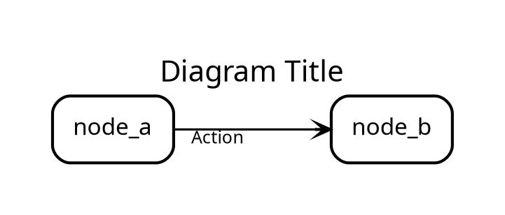

## Purpose

This skill produces **exhaustive, expert-grade visualizations** of any codebase. It generates complete analysis across all architectural aspects without requiring user interaction or selection.

**Target:** A new-grad should produce diagrams as if they'd written the system from scratch.

## Core Principle

**Generate ALL aspects by default.** No selection, no minimal. Every diagram an expert would need to fully understand the system.

---

## Complete Workflow

### Step 1: Entry Point Discovery

```
1. Find main entry point (main.py, index.ts, main.go, etc.)
2. Identify language and framework
3. Determine project type (library, application, service)
```

### Step 2: Module Decomposition

```
1. Map directory structure to module boundaries
2. Identify packages, namespaces, or module groups
3. Find configuration and dependency injection setup
```

### Step 3: Pattern Detection

Automatically detect architecture pattern from structure:

| Pattern | Key Indicators | Files to Prioritize |
|---------|----------------|---------------------|
| Layered | controller/, service/, repository/ | Flow + Types |
| DDD | domain/, application/, infrastructure/ | Types + Storage |
| Event-Driven | events/, handlers/, queues/ | Flow + Concurrency |
| Microservices | independent service directories | Context + Deployment |
| Monolithic | single large codebase | All 8 aspects |
| Hexagonal | ports/, adapters/, core/ | Types + Flow |

### Step 4: Generate All Aspects

Always produce these 8+ diagrams:

| Aspect | File Suffix | Focus | What It Reveals |
|--------|-------------|-------|-----------------|
| Context | `_context` | External users, systems, boundaries | System scope, external deps |
| Components | `_components` | Modules, services, boundaries | Architecture, module deps |
| Types | `_types` | Classes, interfaces, domain model | Core abstractions, relationships |
| Flow | `_flow` | Request pipeline, data journey | Runtime behavior, processing |
| Concurrency | `_concurrency` | Threads, async, events | Parallelism, synchronization |
| Storage | `_storage` | Databases, caches, schemas | Persistence, data model |
| Security | `_security` | Auth, trust boundaries | Protection mechanisms |
| Deployment | `_deployment` | Infrastructure, containers | Runtime environment |
| Memory | `_memory` | Buffers, GC, pointers | Low-level efficiency (if applicable) |
| State | `_state` | Lifecycle, transitions | Resource management |

### Step 5: Expert Annotation

For each generated diagram, add analysis:

```markdown
## [Diagram Name] Analysis

**Architecture Pattern Detected:** [pattern type]
**Key Design Decisions:**
  - [Decision 1] → evidenced by [component/pattern]
  - [Decision 2] → evidenced by [component/pattern]
**Critical Relationships:**
  - [A] → [B]: [why this matters for system behavior]
  - [C] → [D]: [why this matters for system behavior]
**Domain-Specific Insights:**
  - [For this pattern type, experts would focus on...]
```

---

## Aspect Specifications

### 1. Context Diagram (`_context.dot`)

**Focus:** External boundaries and users

**Nodes:**
- External Users (end users, other systems)
- External Services (APIs, databases, message queues)
- System Boundary (the analyzed system)

**Edges:**
- User → System: "uses", "authenticated"
- System → External Service: "calls", "publishes"

**Example:**
```dot
subgraph cluster_external {
  label="External Systems";
  style="dashed,rounded";
  color="#dc3545";
  bgcolor="#fff5f5";
  
  user [label="End User", shape="person"];
  ext_api [label="Third-party API", shape="ellipse", style="dashed"];
}

subgraph cluster_system {
  label="Your System";
  style="rounded";
  color="#0d6efd";
  bgcolor="#e7f1ff";
  
  api_gateway [label="API Gateway"];
  auth_service [label="Auth Service"];
}

user -> api_gateway [xlabel="HTTPS"];
api_gateway -> auth_service [xlabel="validate"];
api_gateway -> ext_api [xlabel="REST"];
```

### 2. Components Diagram (`_components.dot`)

**Focus:** Module boundaries and internal structure

**Nodes:**
- Application Layer (controllers, handlers)
- Domain Layer (business logic, entities)
- Infrastructure Layer (DB, external clients)
- Shared/Kernel (utilities, constants)

**Edges:**
- Layer dependencies (top-down)
- Cross-cutting concerns

### 3. Types Diagram (`_types.dot`)

**Focus:** Class hierarchy and interfaces

**Nodes:**
- Abstract classes (italic label)
- Concrete classes
- Interfaces (diamond)
- Value objects

**Edges:**
- Inheritance (solid, arrow)
- Composition (diamond)
- Association (arrow)

### 4. Flow Diagram (`_flow.dot`)

**Focus:** Request lifecycle and data journey

**Nodes:**
- Entry points (HTTP, CLI, Worker)
- Processing stages
- Decision points (gates)
- Exit points

**Edges:**
- Primary flow (solid)
- Error paths (dashed)
- Async triggers

### 5. Concurrency Diagram (`_concurrency.dot`)

**Focus:** Parallelism and synchronization

**Nodes:**
- Thread/Worker pools
- Event loops
- Message queues
- Lock/Scope boundaries

**Edges:**
- Spawns
- Waits on
- Signals
- Locks

### 6. Storage Diagram (`_storage.dot`)

**Focus:** Data persistence and schemas

**Nodes:**
- Databases
- Tables/Collections
- Cache layers
- File stores

**Edges:**
- Read/Write
- Sync/Async
- Replication

### 7. Security Diagram (`_security.dot`)

**Focus:** Authentication and authorization

**Nodes:**
- Trust boundaries (dashed ovals)
- Auth mechanisms
- Permission layers
- Sensitive data stores

**Edges:**
- Authentication flows
- Authorization checks
- Data access

### 8. Deployment Diagram (`_deployment.dot`)

**Focus:** Infrastructure and scaling

**Nodes:**
- Servers/Containers
- Load balancers
- Service instances
- External services

**Edges:**
- Network paths
- Replication
- Scaling groups

---

## The "ByteByteGo" Style (MUST USE)

Every file MUST include these attributes:



### Color Reference

| Element Type | Stroke Color | Fill Color |
|--------------|--------------|-------------|
| External | #dc3545 (red) | #fff5f5 |
| Services | #0d6efd (blue) | #e7f1ff |
| Domain | #198754 (green) | #e8f5e9 |
| Data | #fd7e14 (orange) | #fff3e0 |
| Security | #6f42c1 (purple) | #f3e5f5 |
| Infrastructure | #6c757d (grey) | #f8f9fa |

---

## Expert Mental Models

### How Experts Decompose Systems

1. **Start at boundaries:** What enters? What leaves?
2. **Find the core:** Where is the business logic?
3. **Trace the flow:** How does data move through?
4. **Identify patterns:** What architecture does it follow?
5. **Map the scale:** How does it handle load?

### Questions Each Aspect Answers

| Aspect | Questions It Answers |
|--------|---------------------|
| Context | What depends on this? What does it depend on? |
| Components | What are the major modules? How do they interact? |
| Types | What are the core abstractions? How do they relate? |
| Flow | How does a request move through the system? |
| Concurrency | How does it handle parallelism? |
| Storage | How is data persisted and accessed? |
| Security | How is access controlled? |
| Deployment | Where does it run? How does it scale? |

### Pattern → Aspect Priority

| Pattern | Primary Aspects | Secondary Aspects |
|---------|-----------------|-------------------|
| Layered | Types + Flow | Components + Storage |
| DDD | Types + Storage | Flow + Components |
| Event-Driven | Flow + Concurrency | Context + Components |
| Microservices | Context + Deployment | Components + Storage |
| Monolithic | All 8 | - |

---

## Output Requirements

### File Naming

All output files follow: `{project}_{aspect}.dot`

Examples:
- `myapp_context.dot`
- `myapp_components.dot`
- `myapp_types.dot`
- `myapp_flow.dot`
- `myapp_concurrency.dot`
- `myapp_storage.dot`
- `myapp_security.dot`
- `myapp_deployment.dot`

### Required Output

For every codebase analyzed, generate:
1. All 8+ `.dot` files
2. A summary `README.md` explaining:
   - Architecture pattern detected
   - Key design decisions
   - How the aspects connect
   - Domain-specific insights

---

## Rendering Instructions

Always provide rendering guidance:

1. **Online:** Paste DOT code into [Edotor.net](https://edotor.net) or [GraphvizOnline](https://dreampuf.github.io/GraphvizOnline)
2. **Local:** Use `dot -Tsvg file.dot -o file.svg`
3. **Excalidraw:** Convert to SVG, drag into Excalidraw for hand-drawn editing

---

## Red Flags - Stop and Correct

* **Edge Labels**: MUST use `xlabel` instead of `label` for edges
* **Curved Lines**: `splines="ortho"` is NON-NEGOTIABLE
* **Font Missing**: `fontname="Virgil"` must be present
* **Single Graph**: Never try to fit all 8 aspects in one diagram
* **Reserved Keywords**: Never name nodes `graph`, `node`, `edge`

---

## Reference Files

- `template/` - Reusable templates for each aspect type
- `examples/` - Complete multi-file examples for different architecture types
